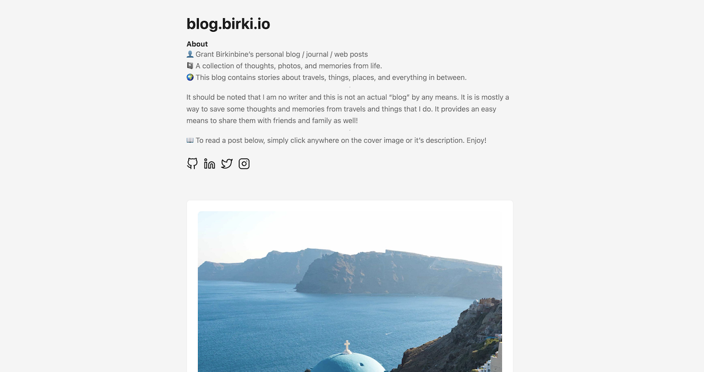

# journal 🌍

[](https://github.com/GrantBirki/journal/actions/workflows/deploy.yml) [](https://github.com/GrantBirki/journal/actions/workflows/ci.yml)

My personal journal / blog about all things

The live site can be found at [journal.birki.io](https://journal.birki.io)



## Development 💻

First, ensure you have the `hugo` binary installed. Then, run the following commands:

```bash
hugo server -D
```

This will start a local development server with live reloads

### WSL Note 📓

If you are using WSL, you will need to run the following commands to ensure the server is accessible from your browser:

```bash
ifconfig # find the IP address of your WSL instance

hugo server --bind <ip> --baseURL=http://<ip> -D
```

## New Blog Post 📝

To create a new blog post, run the following command:

```bash
hugo new posts/my-first-post.md
```

If you don't have the `hugo` binary installed, you can simply create a new folder + file in the `content/posts` directory with the following format:

> note: ensure the file is a `.md` file

```bash
---
title: "Budapest" # The title of the post
description: "Budapest trip" # required for open graph
date: 2017-06-23T00:00:00-07:00 # the date of the post
draft: false # whether or not the post is a draft
cover:
  image: "cover.jpg" # the relative path of the cover image in the media bundle - MUST be named cover.[jpg|png|etc]
  alt: "Budapest" # required for open graph
  caption: "Budapest" # required for open graph
  relative: true # required for open graph (since we use page bundles)
---

## Some cool title

Content goes here!
```

### Open Graph 🌐

> A quick note about [Open Graph](https://ogp.me/)

For both Open Graph and Twitter Cards to work correctly you **must** include the lines as seen below in your post front matter:

- `description` - the description that will be used in open graph
- `cover.image` - the relative path of the cover image in the media bundle - This file **must** be named `cover.[jpg|png|etc]`. It is just important that the file's name is `cover` and it has an image extension
- `cover.alt` - the alt text used in open graph
- `cover.caption` - the caption used in open graph
- `relative` - this is also required for open graph and Twitter Cards to work correctly. Since we use [page bundles](https://gohugo.io/content-management/page-bundles/), we need to set this to `true` every time

## Theme 🎨

This site uses the [hugo-PaperMod](https://github.com/adityatelange/hugo-PaperMod) theme

For more details on configuration, see the [features](https://github.com/adityatelange/hugo-PaperMod/wiki/Features) page on the theme's wiki

## Hugo Shortcodes 📄

Huge has a **ton** of built-in [shortcodes](https://gohugo.io/content-management/shortcodes/#use-hugos-built-in-shortcodes) that can do a bunch of things from rendering GitHub Gists, to Tweets, to YouTube videos, and a whole lot more.

## Video Support 📹

This site also supports embedded videos with the following extensions:

- `.mp4` / `.m4v`
- `.webm`
- `.ogv`

Add the video to the page bundle (alongside the `.md` file and images) and then you can reference the file without its extension like so:

```bash

```

or

```bash

```

> To learn more about the theme that provides video support, check out the [hugo-video](https://github.com/martignoni/hugo-video) repository
