## Intro

In the past, Leah has done a **lot** of planning for our trips. During Leah's first semester at King's College London, I had planned a trip on my first visit to [London and Norway](/posts/london-and-norway). The majority of the trip to Norway was a surprise and it was a huge success!

Before my next trip out to London, I started planning another "surprise trip" for Leah and I to go on, and this time we were heading to Morocco! 🇲🇦

However, the trip did not remain a full surprise for long as I'm terrible at keeping secrets and Leah is a sneaky detective. While we were in [Paris](/posts/paris) (just a week before the trip) waiting for the Metro, there was a massive "Visit Morocco" poster on the wall. Leah just looked at the poster and went *"hmmmm"*. I'm pretty sure my laugh gave it all away.

## Marrakech

### Friday 2/17

We woke up early to pack for our "surprise trip", although at this point Leah was about 98.5% sure we were going to Morocco. This kind of helped though because she was looked at the weather there and that was helping her along with packing.

We took the train from London to Gatwick Airport and then took off to Marrakech.

✈️

When we arrived in Marrakech it was pretty late so we just took a taxi to our AirBnb, got some food at a nearby restaurant, and then went to bed.

### Saturday 2/18

Saturday was another early morning that started with travel. Our AirBnb was intentionally right across the street from the main train station in Marrakech since I had booked us train tickets to Casablanca. Last night at dinner, Leah keep guessing where we were going and Casablanca was not a single one of her guesses so she was completely surprised when we got on the train.

> I managed to get at least one surprise right at last! 😂

> Grant reading on the train

We managed to get off at the wrong train station coming into Casablanca and this was honestly foreshadowing for our time in Casablanca. We managed to get back on the train just before it left after we looked at our phones and realized we were in the wrong place. After getting back on the train, I had realized that I had rolled my suitcase through an enormous pile of wet poop (all over my shoes as well... delightful).

Soon we had arrived in Casablanca (at the correct stop) and made our way out of a train station. As Leah laughed, I rolled my luggage through a sprinkler outside.

We took a taxi to our AirBnb and then went into a nearby cafe while we waited for the cleaner to finish so we could drop off our bags.

> Leah in the taxi on our way to our AirBnb

Casablanca was **chaotic**... 😬

There were so many people, the cars all drove like they were on a death wish, and the streets were an absolute disaster.

This was my very first time in any part of Africa and it was honestly so overwhelming and rather stressful.

After finishing our Moroccan mint tea, dropped off our luggage, and set off on a stroll to the nearest "medina" (old city / market).

While planning this trip I had done some research around medinas and had a wildly different vision in my head. Online you see photos of these vibrant medinas with fine tile work, beautiful arches, and shops full of color spices. The reality was a bit different...

The medina we visited was full of shops containing knock-off Nike shoes, fake luxury bags, and shampoo. We went into one shop that looked like it had spices but the most interesting thing we found was what we believed to be "prostate stimulating powder".

We prompted left the medina and began to walk back to our AirBnb to asses the current situation that was Morocco.

> Walking around Casablanca there were many stray cats taking a snooze on scooters and the roofs of cars

> A typical side street with vendors in Casablanca

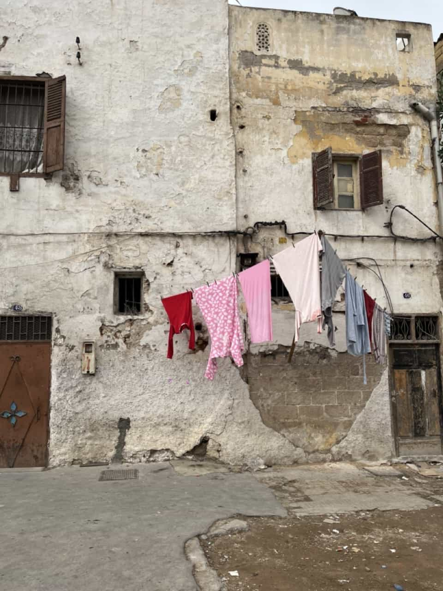

> A home in Casablanca doing laundry day

---

#### Trip Adjustment

> A brief note about our trip adjustments back at our AirBnb

We had been in Morocco for about 16 hours at this point and realized we were in a bit over our heads. Leah was anxious, I was borderline having a break down, and everything around us felt like chaos. So we had a quick chat and I decided to tell Leah all the details about the trip we had planned. It wasn't exactly as she had imagined and all of Morocco so far was not at all how I imagined it. So we planned together to find a place our of the chaos this afternoon and also look at the schedule for the rest of our trip later that night.

---

After our "trip adjustment pow-wow", we headed over to the "fancy" area of Casablanca to get some food and escape from the chaos of the inner city. Our first stop was the beach to check out the Atlantic ocean. Getting close up to the water it was rather nice to look out and just hear the waves wash out the sound of the city. On our way back to the main road, we encountered a pretty angry dog chained to a broken railing. The dog saw us, started barking, and leap towards Leah and I. We both saw that it pulled right away from the fence and both the dog and the broken piece of chained fence started coming towards us. We both turned around and went full sprint down the steps. A bunch of locals laughed at us but we didn't find the dogs teeth too comical in the moment.

We tried another set of steps that didn't have any angry dogs and found ourselves in front of a "Four Seasons" hotel. We figured *why not* and basically snuck into the Four Seasons and sat down in the restaurant. We took one look at the menu and promptly left when we saw the prices 😂.

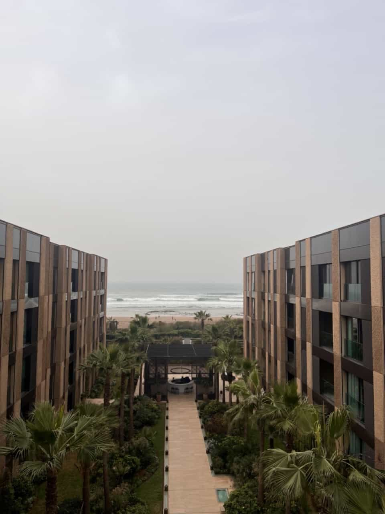

> The view from the cafe at the Four Seasons (that we snuck into)

We walked down the street a bit and ended up in a fairly nice restaurant and got some pasta, a smoothie, and a nice pizza. After our dinner, we found one of the few places in the city that served alcohol nearby and went for a few drinks to ease our nerves from the chaotic day.

Overall, our sentiment on Casablanca was that it was a bit of a mess and not a place one should go if you're looking to relax or see sights.

> I am writing this section as we are sitting in the AirBnb after the day in Casablanca and we are both very excited to be leaving tomorrow evening 🙃.

### Sunday 2/19

On Sunday we slept in until 10am. We were both really not looking forward to getting up and having to leave the comfort of our AirBnb. Casablanca was just so chaotic and it didn't feel like there was much to do. We would also be checking out and would have to carry around all our bags for the day.

The night before, we had done some research and discovered that the best thing to do in Casablanca was to visit the **Hassan II** mosque of Casablanca. So we set out with all of our packs to the mosque via taxi.

We booked a tour for noon and then popped into a cafe to fuel up on coffee and pancakes before heading back for our tour.

> The cafe which bestowed pancakes upon of rumbling bellies

To our knowledge, this is one of the few mosques you can actually tour in Morocco as a non-muslim since they are usually quite strict on who can enter and you must have a tour.

The mosque tour actually helped put us back on track with traveling as we really enjoyed it. While it wasn't "historic" in terms of age (constructed in 1993) it was extremely impressive by its design. The entire building was garnished in very intricate Islamic carvings. You could stare into many of the designs and be mesmerized.

> One of the countless designs on the ceiling of the mosque

Some photos we took of the mosque:

> The ceiling behind the main entrance

> The main room of prayer in the mosque

> The mosque from the outside

> Leah doing a mini photo shoot

> Behind the scenes of Leah's photo shoot

> Grant doing a photo shoot

The mosque was really quite beautiful and we both thought it helped turn our rough stay in Casablanca back around!

After the mosque we pretty much just hung out, got some food, read books, and then caught our train back to Marrakech 🚋. We booked a traditional riad for the night and were very excited to see what it's all about!

> Catching the train back to Marrakech

We got into Marrakech fairly late and had a light snack at our riad. It was wonderful! We were now feeling like we were in the Morocco that we had read so much about. The riad had travelers from all over, was garnished in fine rugs, tiles, and friendly hosts. Leah booked this riad for us only hours before and it was a great choice!

### Monday 2/20

The day before we had also made another slight adjustment to our trip. We originally had a "group tour" into the Sahara desert for three days. Upon consideration with Leah, we changed it to a "private tour" with our own dedicated driver. The driver arrived at our riad at 9:00am so we only had time for a quick coffee and a crepe before hitting the road.

> Walking to our car with Mohammad (seen on the very right)

Our trip with Mohammad would be a three day journey through the high Atlas mountains, through many Berber small villages, and into the Sahara desert.

As we left Marrakech and entered the Atlas mountains, the view quickly changed from old city streets to beautiful mountains with deep red soil.

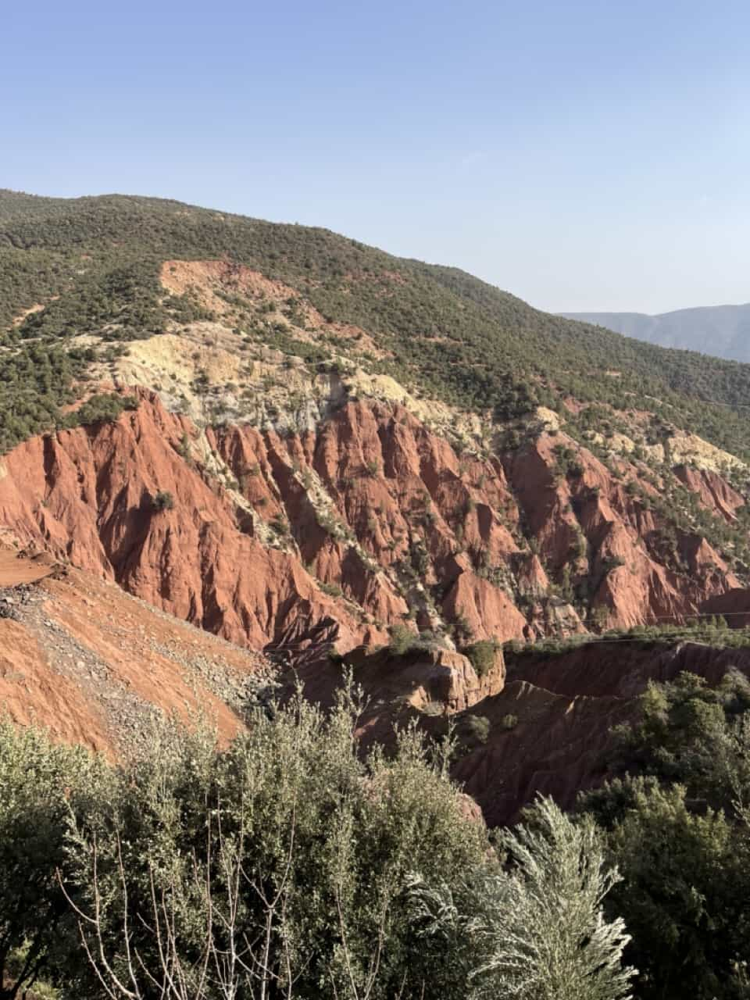

The roads were starting to get cold, windy, and very narrow so we made a quick stop for some mint tea to warm up.

Soon after, we were on a steep mountain pass and got out to take a few photos. Leah and I nearly blew over from the wind gusts which must have been 70mph+.

> The view from the incredibly windy summit

As we continued on, we passed through countless Berber villages. We would often see bundled up old women walking in the hills with herds of goats and sheep.

Our driver turned onto a back road and we went off the beaten path before arriving at a small village where we would be visiting a hidden gem of Morocco - [Kasbah Telouet](https://en.wikipedia.org/wiki/Telouet_Kasbah). The Kasbah used to be a palace for the Glaoui family, a powerful Berber tribe along a caravan trade route. During its peak, the Glaoui family was more wealthy than the actual king of Morocco. We learned that during this time salt was incredibly valuable. In fact, the traders living at the Kasbah would trade one kilogram of their salt for a kilogram of gold. The Kasbah is in a very remote area and is now only accessible by local guides (such as the one we had). There were guards at the edge of the village as well.

> A "Kasbah" is a type of palace or fortress that was built in the desert. They were often built by the Berber tribes and were used as a place to store their wealth and as a place to stay during their travels.

From the outside, the Kasbah looks fairly run down from erosion and the elements; but the inside is absolutely stunning.

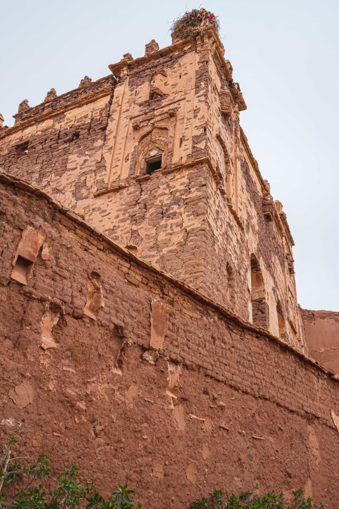

> The outer walls of the Kasbah and a corner guard tower

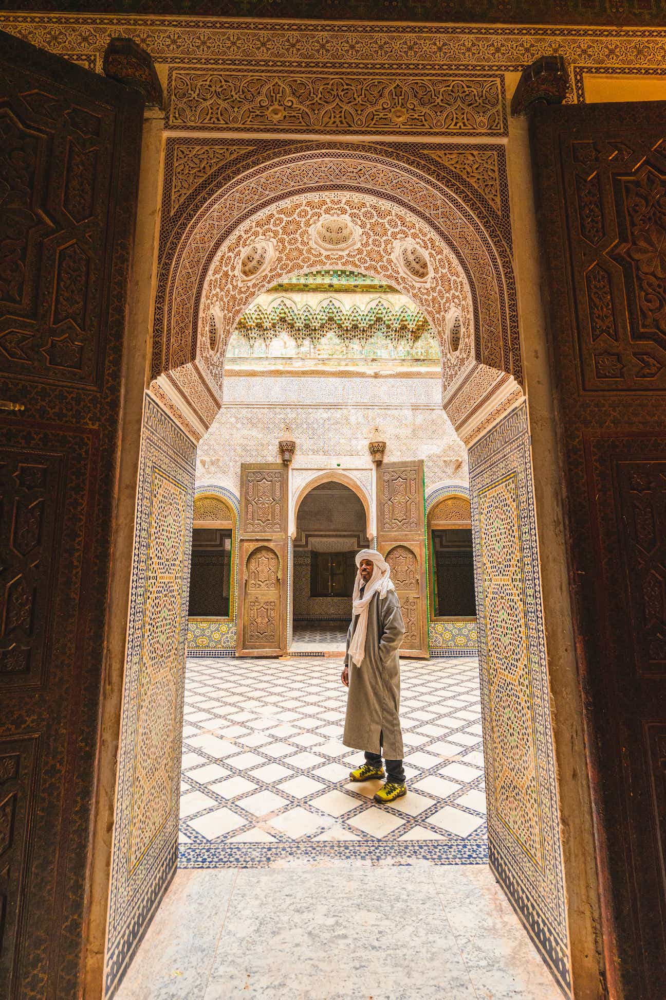

> The inside of the Kasbah with our Kasbah guide - He could speak English, French, Spanish, and Arabic. He was born in the smaller Kasbah next door and still lives there with his wife today

> Inside of a main gathering room of the Kasbah

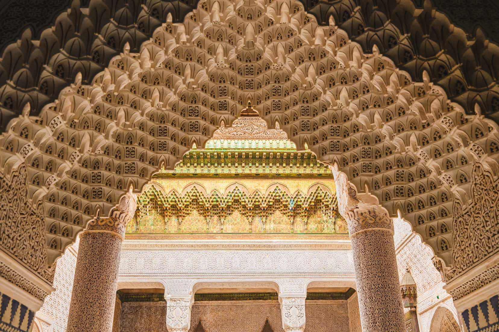

> Intricate cedar and plaster carvings on the ceiling

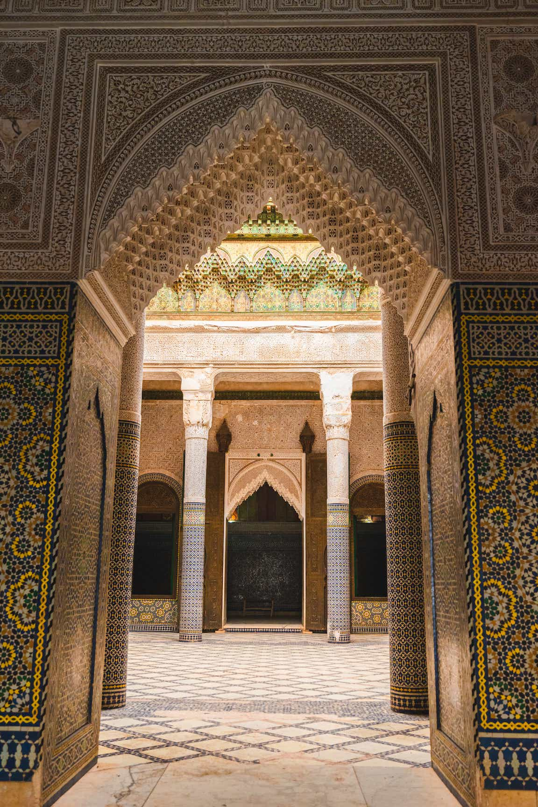

> Looking into the main gathering room from the dinning room

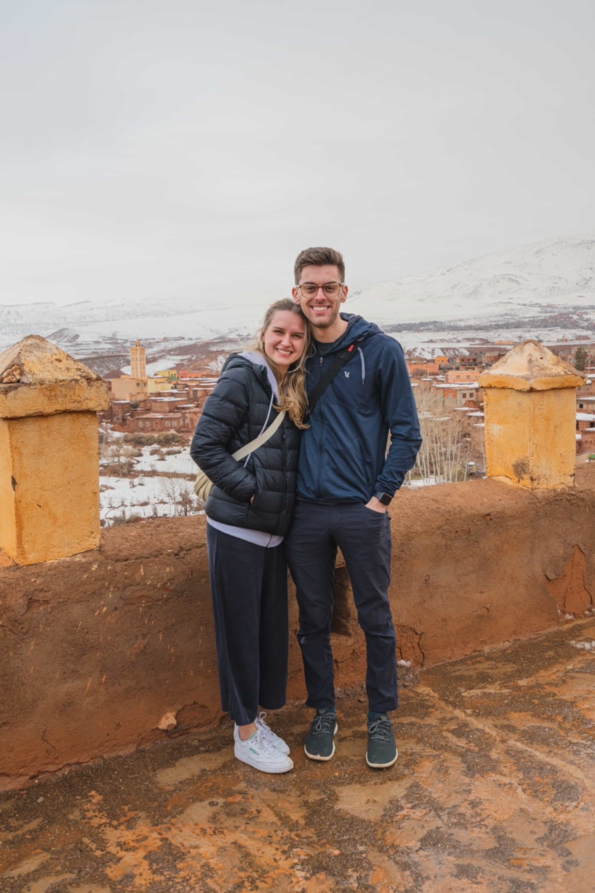

> Me and Leah on the roof of the Kasbah

> Looking down into one of the many courtyards from the roof

The Kasbah was one of our favorite stops on the first day of our trip and the fact that we went with the more expensive "private guide" already felt like it was worth every single penny.

After the Kasbah, we walked into a small dining room nearby to have some lunch. We had lamb tajine and more mint tea. The tajine was delicious and we wished that we hadn't split just one.

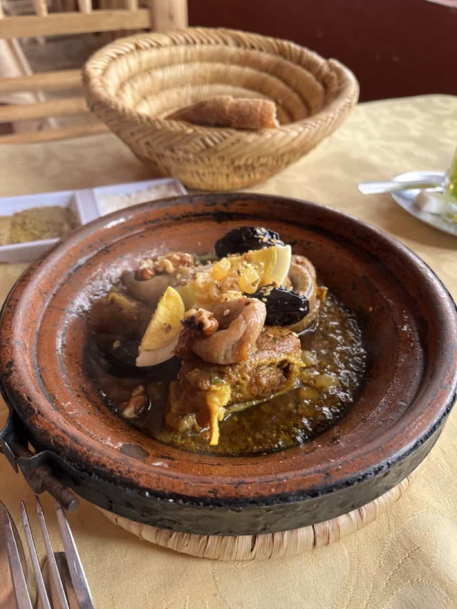

> Incredibly flavorful lamb tajine

After lunch we continued our descent down the Atlas mountains. Our driver made a quick off-road detour to a nice panoramic view of the mountains and a village below.

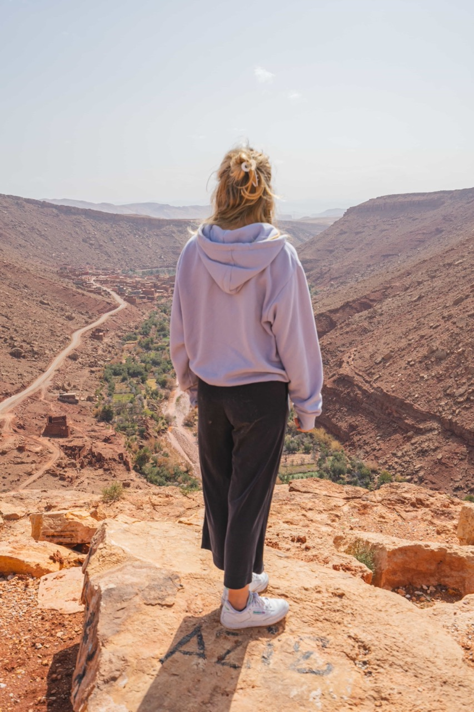

> Leah at the panoramic view

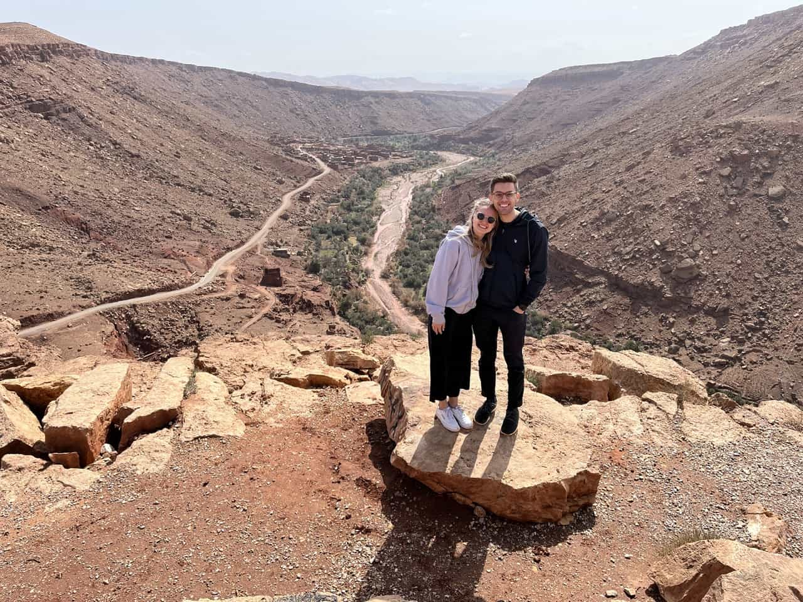

> G+L

> Our car, the driver/guide Mohammad, Leah, and the mountains

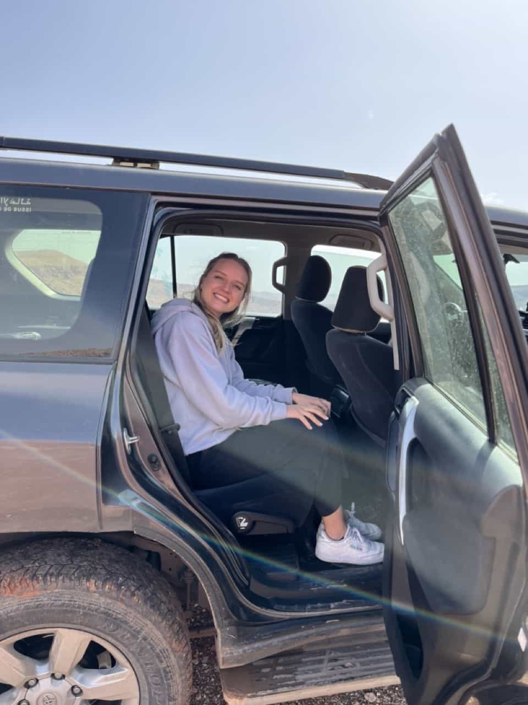

> Leah in the back seat

As we drove even further down the mountains there started to be even more villages, almost no wind, and a lot less snow.

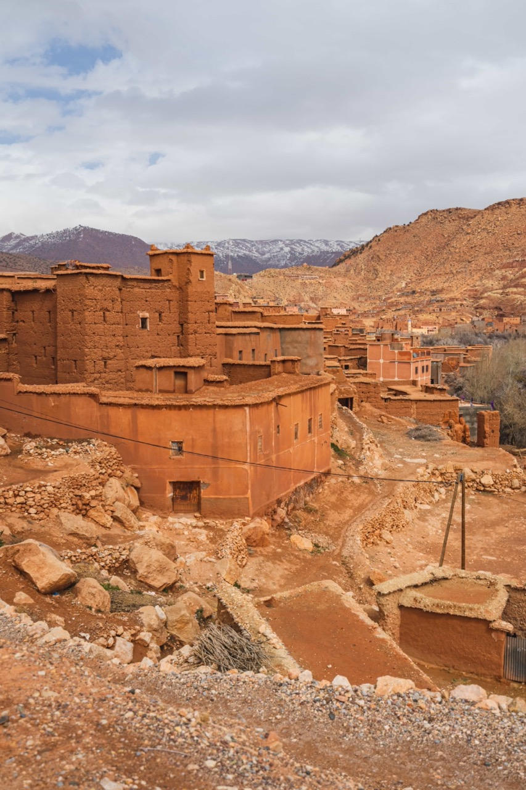

> A small Berber village placed on the edge of a river with small farm plots - Yes, nearly all these homes are inhabited

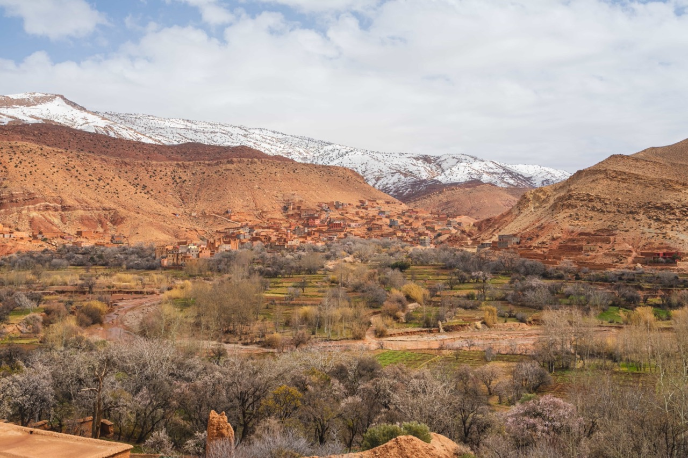

> An oasis of green crops with villages surrounding it

After our long and very narrow descent out of the mountains, we arrived at a small caravan village. It had another Kasbah positioned on the top of a butte and our driver stopped to let us explore. He hung out in the car while we spent about an hour checking the area out.

This small village was equally vibrant and full of colors.

> The inner streets of the Kasbah on the hill

> Leah on the very top of the hill, looking out over the village

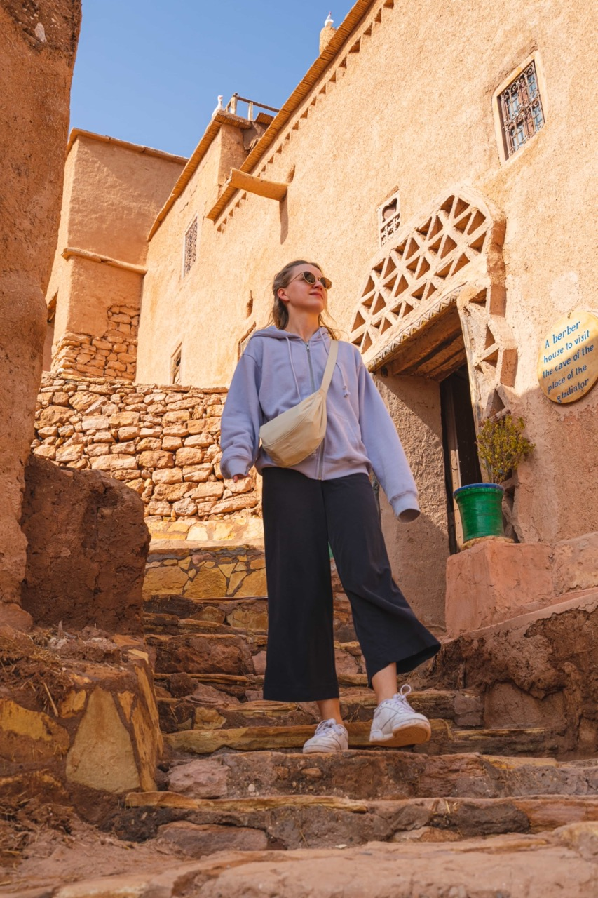

> Leah on a stroll down the steps

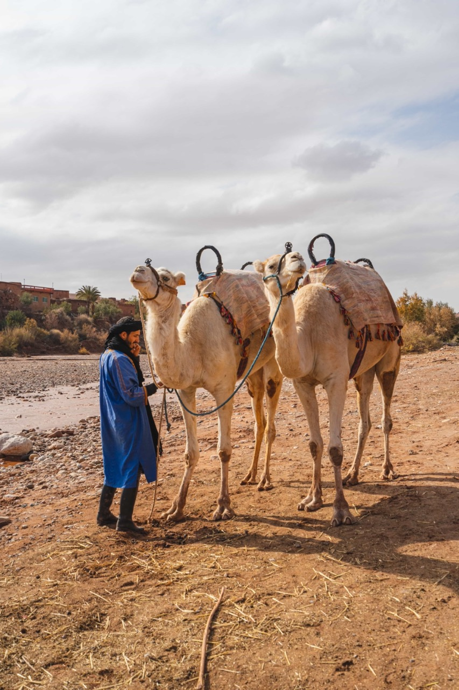

> White dromedaries by the river - The dromedary is a camel with "one hump", also known as the Arabian camel

This was our last stop until our driver dropped us off at our riad for the night. When we arrived at the riad we both felt very sleepy from the car ride so Leah did the classic "time to read a book" and proceeded to fall asleep next to me as I edited photos (for this blog). We had a lovely dinner of chicken tajine and went to bed early as our driver would be there at sun rise to begin our journey into the Sahara desert! 🐪

> The view from the first floor of our riad

### Tuesday 2/21

We had our alarms set for 7:00am but they were not needed as the riad we right next to a mosque. We awoke promptly at 6:45am to the sound of Muslim prayers being broadcast over load speakers and people praying from the tops of nearby buildings. It was still quite dark outside and rather cold but we managed to force ourselves downstairs for some coffee and bread with jam. Our driver, Mohammad, met us outside after breakfast and we were off on our way to the Sahara desert!

The landscape quickly started turning from sharp and rocky to quick and sandy as we began our journey.

> View from the road of the landscape

We made a quick stop at a town centered in an oasis at a local police station that had a good panoramic view.

> G + L in the oasis

As we kept driving, we passed through two large Moroccan style gates. Our driver let us know that this signified we had "entered the desert". Just after the gates we stopped at a small town for a coffee before we kept driving.

After a few more hours of driving, we stopped at a small town that was known for creating vibrant green pottery. Mohammad asked if we wanted to stop and check out the process of pottery making. We said "sure!" and one of the locals showed up around. Before our mini pottery tour, Leah and I vowed not to buy anything because we had almost no room in our bags. Well... that didn't stand because the pottery was amazing so we bought some small cups and coffee mugs.

> The main area where the pottery takes place

> The ovens where the pottery goes to set in

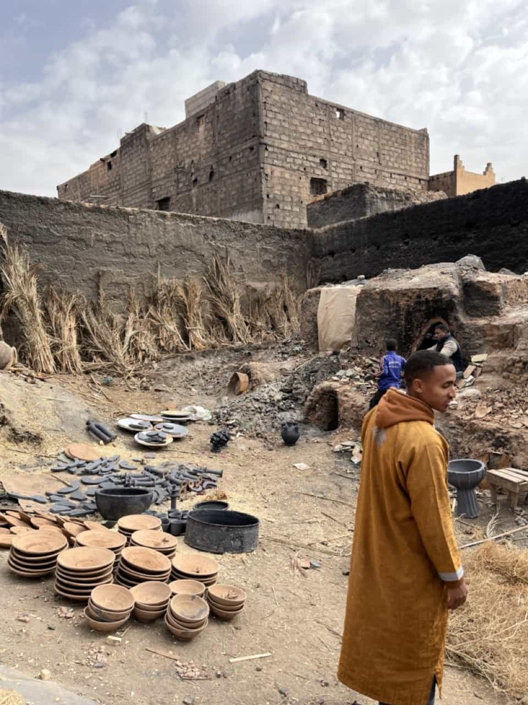

> Another shot of the ovens

After obtaining our pottery, we set off to our last stop before the roads ended and our real adventure began. We stopped at [M'Hamid](https://en.wikipedia.org/wiki/M%27Hamid_El_Ghizlane) which is the last real civilization before entering the Sahara. Mohammad is actually from this town and you would know right away as we started to enter it. He was rolling down his window and greeting just about every single person we saw. If we were not on a short time schedule, it could have taken us days to pass through the town as just about everyone recognized him and wanted to say hello. We stopped at a small building and picked up a "picnic" style lunch from one of his friends (or possibly family members) before we left the town behind.

The roads turned to dirt and were *rough*. As Mohammad said "this is the massage" and it certainly was some form of massage on the back (not sure if a good one ha). We stopped under one of the few trees we could find to eat our picnic lunch after checking out some wandering Arabian camels. Even though the desert seemed completely empty we were not alone though. There were plenty of desert beetles that came to visit us and enjoy some of our rice (they were very kind).

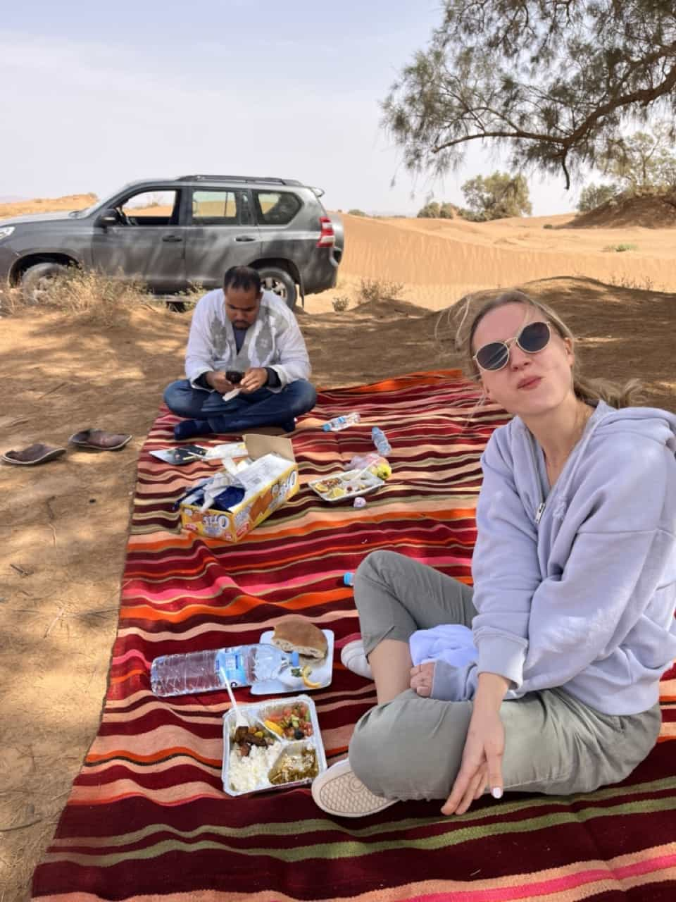

> Leah and Mohammad having lunch

> The view of our road out into the desert
